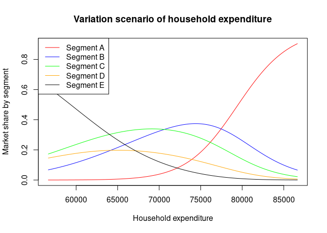

<!-- README.md is generated from README.Rmd. Please edit that file -->

# CoDaImpact

<!-- badges: start -->
<!-- badges: end -->

[**CoDaImpact**](https://lukece.github.io/CoDaImpact/) provides
additional tools for the interpretation of regression CoDa models. It is
conceived as an extension of the
[**compositions**](http://www.stat.boogaart.de/compositions/) package.

## Installation

You can install the development version of **CoDaImpact** from
[GitHub](https://github.com/) with:

``` r
# install.packages("devtools")
devtools::install_github("LukeCe/CoDaImpact")
```

## Example of a Y-compositional model

Below, we estimate a CoDa model that explains the market shares of [five
segments of the car
market](https://en.wikipedia.org/wiki/Car_classification#Market_segments)
in France. To illustrate the influence of the `HOUSEHOLD_EXPENDITURE` on
the market shares in each segment we use a `VariationScenario()`. In
this scenario the `HOUSEHOLD_EXPENDITURE` is moved along a grid while
all other variables are fixed to the values of the first observation.

``` r
library("CoDaImpact")
data("car_market")

model_car_segements <- lmCoDa(
  ilr(cbind(SEG_A, SEG_B, SEG_C, SEG_D, SEG_E)) ~
    GDP + HOUSEHOLD_EXPENDITURE + GAS_PRICE,
  data = car_market)

VS <- VariationScenario(
  model_car_segements,
  Xvar = "HOUSEHOLD_EXPENDITURE",
  obs = 1,
  inc_size = 100, 
  n_steps = 150,
  add_opposite = TRUE)


plot(x = VS$HOUSEHOLD_EXPENDITURE, y = VS$Y[,1],type = "l", col = "red",
     main = "Variation scenario of household expenditure",
     xlab = "Household expenditure", ylab = "Market share by segment")
lines(x = VS$HOUSEHOLD_EXPENDITURE, y = VS$Y[,2],type = "l", col = "blue" )
lines(x = VS$HOUSEHOLD_EXPENDITURE, y = VS$Y[,3],type = "l", col = "green")
lines(x = VS$HOUSEHOLD_EXPENDITURE, y = VS$Y[,4],type = "l", col = "orange")
lines(x = VS$HOUSEHOLD_EXPENDITURE, y = VS$Y[,5],type = "l", col = "black")
legend("topleft",
       legend = paste0("Segment ", LETTERS[1:5]),
       col = c("red", "blue", "green", "orange", "black"),
       lty = 1)
```


